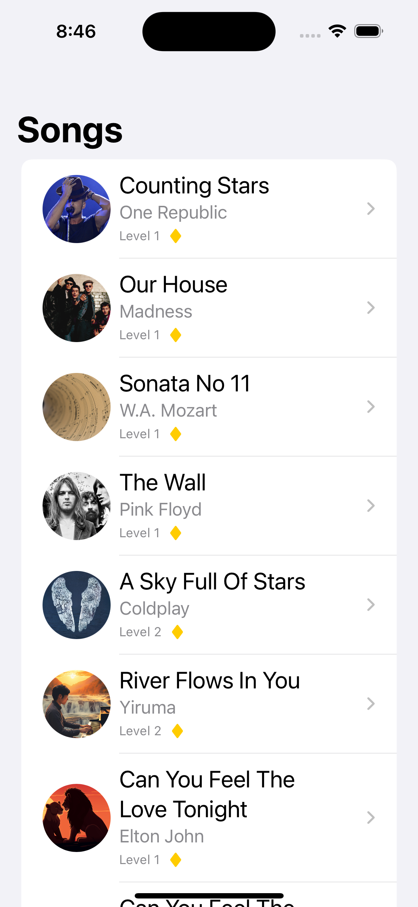
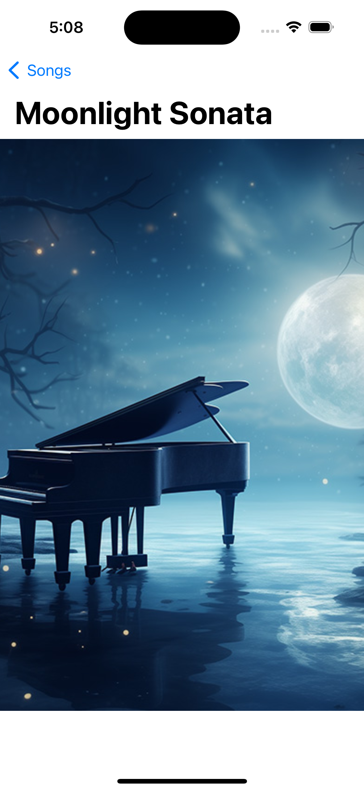

# Skoove Coding Challenge 2024 (SwiftUI)

## Introduction
As a hypothetical member of the team, your task is to work on a feature request for an existing project (more details in the following sections) and create a merge PR that will be reviewed by your teammates. 
We are interested in seeing how you work in close-to-real-life scenarios, rather than wasting time building mini-apps from scratch or answering whiteboard-style questions. The estimated time is around 6 hours. Good luck!

## Requirements
The challenge is in the form of an Xcode 15 project. No third-party libraries, real iOS devices, or internet connection are required to build and run the project.

## Steps
- You will receive an e-mail with an invitation to this repo. Accept and clone it on your development environment.
- Create a branch out of `develop`.
- After done working, commit your changes, push them, and open a PR from your branch to `develop`. Feel free to add any comments that you think are relevant.
- Then add these usernames to the project: [mjfroehlich-skoove, daniil-s-skoove, asourlas-skoove, and YaminYazdanpanah] and wait for our review.

## The task
The task is based on an existing mini-project. The project implements a simple iOS app that does the following: as soon as the user opens it, it loads and displays a list of song data. When the user taps on one of the songs, they are directed to a song detail screen.

Your task is to extend it based on the description and the acceptance criteria. Please do not forget to read the notes!

**Description**
As a user, I want to see a comprehensive list of the available songs and their metadata. I also want to tap on a song and see its full image.

**Acceptance criteria**
- The song list should be extended to display, in addition to the song name, the tile image, the name of the artist, the song level, as well as whether the song is premium. Tapping on a song should lead to a detailed screen that displays the tile image without any consideration regarding resizing or scaling.
- The visual format of the list should be similar to the screenshots below. You do not need to do a pixel-perfect replication but your implementation should be reasonably close to the design.

### Song list screen

### Song detail screen

**Notes**
- 
- Use the ♦ character in yellow to indicate whether a song is premium.
- The existing code might (wink) contain parts that are poorly designed/written. Please refactor accordingly if you find something. You do not need to nitpick on details but pay special attention to the essentials such as concurrency, error handling, testability, etc. 
- Do not forget the Unit Test! Please make sure that it passes before submitting.
